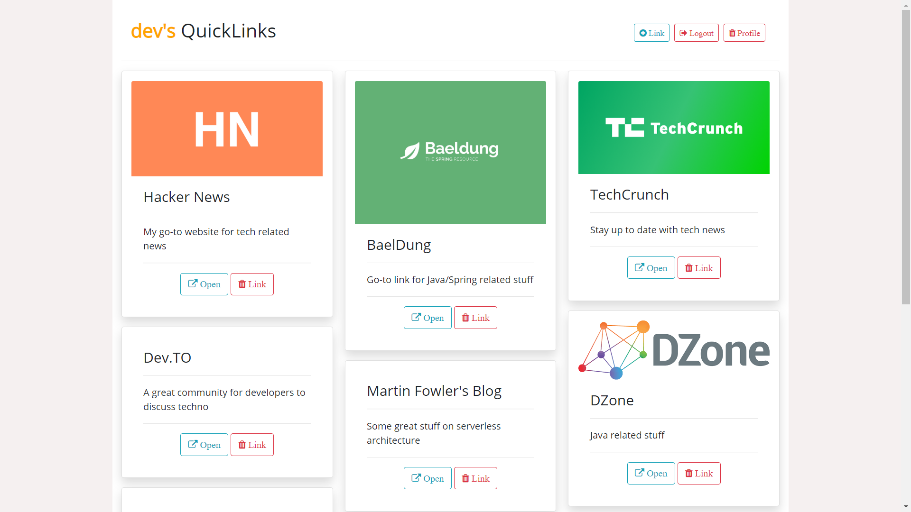

<h1 align="center"> QuickLinks 👋</h1>
<p>
  
  
  
  
</p>

>  Replace existing Google Chrome homepage with unlimited links to your favorite pages.

This application will provide you a homepage for quickly accessing your favorite sites. Google Chrome does provide this option but unfortunately it is limited to 10 websites only. Using **Quicklinks** you can practically store unlimited number of links for quick access.

Set the application as your homepage :)




## Usage

The application is currently deployed on Heroku - [QuickLinks](https://quick-links-app.herokuapp.com/dashboard)
> **Note** - The app is deployed on a free tier of Heroku and may not be live due to any sudden outages. Raise an [issue](https://github.com/boudhayan-dev/QuickLinks/issues) and I'll try my best to get it working again.

However, if you do not want to use the hosted app, you can also run it locally. Following are the steps to run it locally -

* Create a `.env` file in project directory containing the following values -

  ```
    DBURL=<<MONGODB_CONNECTION_URL>>
    SECRET=<<SECRET_FOR_PASSPORTJS_CONFIG>>
    PORT=<<OPTIONAL_VALUE_FOR_EXPRESS_PORT>>
  ```

* For MongoDB, you can run a mongo instance locally -

  ```
  mongod --dbpath=C:\Users\...\Desktop\mongodb-data-folder
  ```

* After starting the mongo instance, run the app locally from the root as -

  ```
  npm run start
  ```

* Visit the URL once the app starts up -

  ```
  http://localhost:<<PORT>>/dashboard
  ```


## Author

👤 **Boudhayan Dev**

* Github: [@boudhayan-dev](https://github.com/boudhayan-dev)
* LinkedIn: [@boudhayan-dev ](https://www.linkedin.com/in/boudhayan-dev/ )

## 🤝 Contributing

Contributions, issues and feature requests are welcome!<br />
Feel free to check [issues page](https://github.com/boudhayan-dev/QuickLinks/issues). 

## Show your support

Give a ⭐️ if this project helped you!

***
_This README was generated with ❤️ by [readme-md-generator](https://github.com/kefranabg/readme-md-generator)_