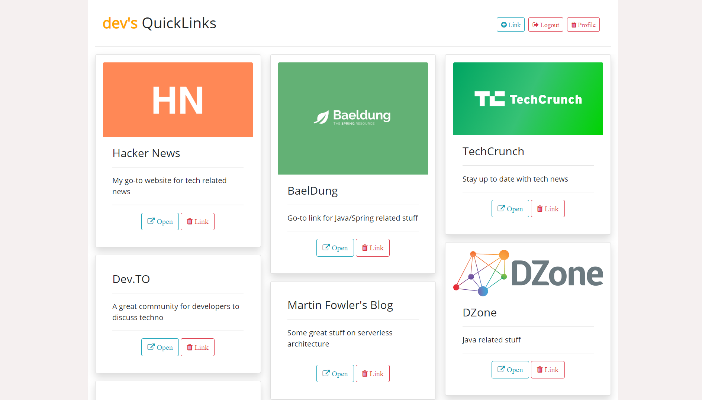

<h1 align="center"> QuickLinks 👋</h1>

  
  
  
  

>  Replace existing Google Chrome homepage with unlimited links to your favorite pages.

This application will provide you a homepage for quickly accessing your favorite sites. Google Chrome does provide this option but unfortunately it is limited to 10 websites only. Using **Quicklinks** you can practically store unlimited number of links for quick access.

Set the application as your homepage :)

## Usage

**WORK IN PROGRESS**

## Author

👤 **Boudhayan Dev**

* Github: [@boudhayan-dev](https://github.com/boudhayan-dev)
* LinkedIn: [@boudhayan-dev ](https://www.linkedin.com/in/boudhayan-dev/ )

## 🤝 Contributing

Contributions, issues and feature requests are welcome! 
Feel free to check [issues page](https://github.com/boudhayan-dev/QuickLinks/issues). 

## Show your support

Give a ⭐️ if this project helped you!

***
_This README was generated with ❤️ by [readme-md-generator](https://github.com/kefranabg/readme-md-generator)_